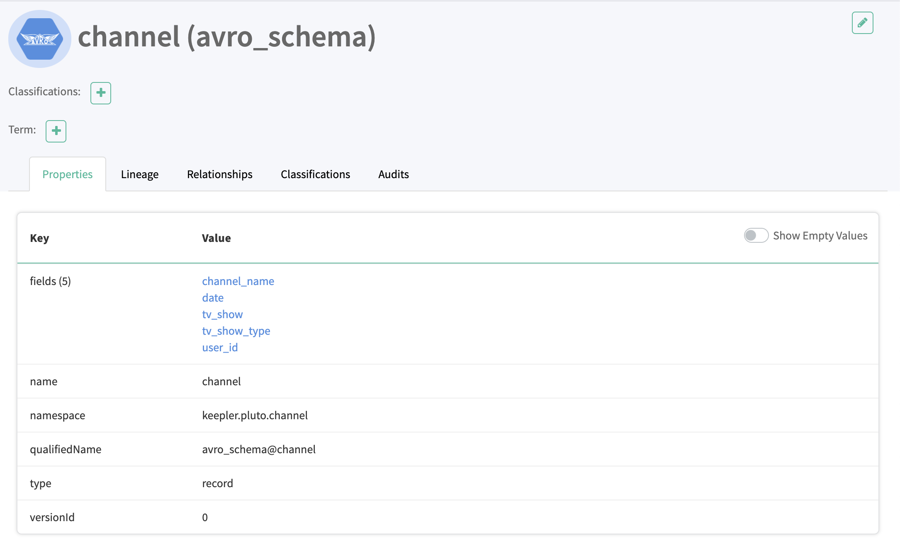
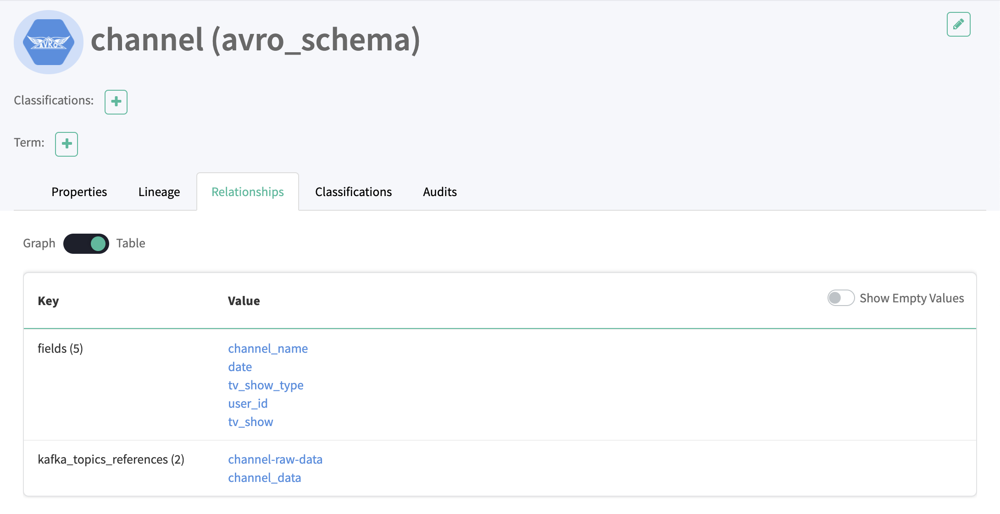
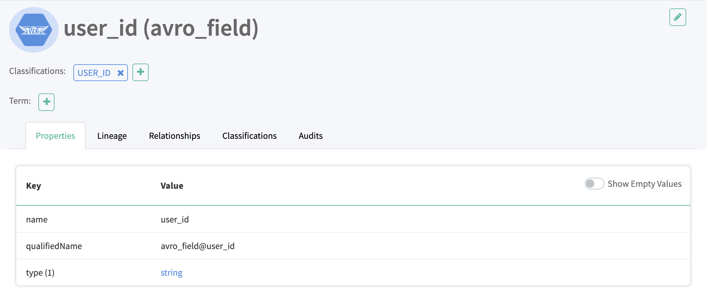
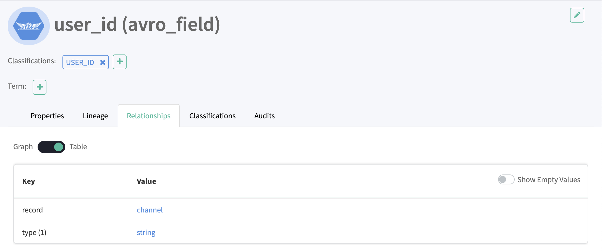

# Meet European Data Security and Privacy Compliance with Big Data Analytics in Public Cloud Environments

## Introduction

This technical demo is related to the following articles series published by [Keepler](https://keepler.io) called **Meet European Data Security and Privacy Compliance with Big Data Analytics in Public Cloud Environments**.

* [Part 1: Foundations](https://keepler.io/2021/09/european-data-security-and-privacy-compliance-part-1-foundations/)
* [Part 2: Case Studies in Business Environments](https://keepler.io/2021/10/meet-european-data-security-and-privacy-compliance-with-big-data-analytics-in-public-cloud-environments-part-2-case-studies-in-business-environments/)
* [Part 3:](#)TODO

It is advisable to read the articles beforehand to understand the problems to be solved and the proposed framework. 

## Solution Overview
 #TODO
 image here

explain the tech selection

## Quickstart

We use Docker Compose to easily run the solution in an isolated environment built with Docker containers. Before starting, make sure you have install [docker](https://docs.docker.com/get-docker/) and [docker-compose](https://docs.docker.com/compose/install/)

### Build and run containers
In the root of the project run the following command, which will download the images from the remote repositories and build the custom images we have created.
```
docker-compose up --build
```
Make sure you have enough memory allocated to docker to prevent troubleshooting problems.

You can check that the containers are correctly lifted by running the following command
```
docker ps
```

```
CONTAINER ID   IMAGE                                   COMMAND                  CREATED       STATUS
3cf8b81a807d   demo_datapipeline_worker                "python3"                2 hours ago   Up 3 seconds
da58ad65d220   demo_producer                           "python3"                3 hours ago   Up 5 seconds
f0833097caa5   demo_spark-slave                        "/opt/bitnami/script…"   5 hours ago   Up 8 seconds 
8433542d91aa   demo_spark-master                       "/opt/bitnami/script…"   5 hours ago   Up 10 seconds
2b6cb71102c6   sansarip/apache-atlas                   "/opt/atlas_start.sh"    6 hours ago   Up 10 seconds
14d967dc967b   confluentinc/cp-schema-registry:5.3.6   "/etc/confluent/dock…"   2 weeks ago   Up 5 seconds
e60717eeb2a3   confluentinc/cp-kafka:5.4.0             "/etc/confluent/dock…"   2 weeks ago   Up 8 seconds
5625f65b8296   wurstmeister/zookeeper:3.4.6            "/bin/sh -c '/usr/sb…"   2 weeks ago   Up 10 seconds
```

### Setup Apache Kafka
For the purpose of the demo we need to have several [Apache Kafka](https://kafka.apache.org/) topics created.
To do this, run the file `create-kafka-topics.sh`
```
./create-kafka-topics.sh
```

You can check that the topics are created correctly by executing the following command:
```
docker-compose exec kafka kafka-topics --list --zookeeper zookeeper:2181
```
It will show you the following output:

```
__confluent.support.metrics
__consumer_offsets
_schemas
channel-anonymised-data
channel-raw-data
mobile-anonymised-data
mobile-raw-data
movie-anonymised-data
movie-raw-data
website-anonymised-data
website-raw-data
```

### Generate sample messages

Inside the `src/dummy_data` folder you can find different types of messages to publish in [Apache Kafka](https://kafka.apache.org/). **We recommend to post all** of them to see all the **different behaviors of the solution**.

To send the messages you only have to execute the different scripts that are in the folder `src/data_generators`.
However, they have to be executed inside the ecosystem, in this case from the **producer container**.

To do so, run the following commands:
```

# Generate channel data
docker-compose exec producer python /opt/app/data_generators/producer_kafka_channel.py

# Generate movie data
docker-compose exec producer python /opt/app/data_generators/producer_kafka_movie.py

# Generate website data
docker-compose exec producer python /opt/app/data_generators/producer_kafka_website.py

# Generate mobile data
docker-compose exec producer python /opt/app/data_generators/producer_kafka_mobile.py
```

You can check the messages posted within the topics with the command
```
docker-compose exec kafka kafka-console-consumer --bootstrap-server kafka:9092 --topic <TOPIC> --from-beginning
```

For example the messages in the topic **channel-raw-data**.
```
{"channel_name": "Fox", "tv_show": "9-1-1", "tv_show_type": "Drama", "date": "12-10-2020", "user_id": "user-12345"}
{"channel_name": "Fox", "tv_show": "9-1-1", "tv_show_type": "Drama", "date": "12-10-2020", "user_id": "user-23456"}
{"channel_name": "Fox", "tv_show": "9-1-1", "tv_show_type": "Drama", "date": "12-10-2020", "user_id": "user-45678"}
{"channel_name": "Fox", "tv_show": "9-1-1", "tv_show_type": "Drama", "date": "07-09-2020", "user_id": "user-12345"}
{"channel_name": "Fox", "tv_show": "9-1-1", "tv_show_type": "Drama", "date": "23-08-2020", "user_id": "user-87654"}
{"channel_name": "Fox", "tv_show": "9-1-1", "tv_show_type": "Drama", "date": "23-08-2020", "user_id": "user-12345"}
{"channel_name": "HBO", "tv_show": "Barry", "tv_show_type": "Comedy", "date": "20-04-2020", "user_id": "user-23456"}
{"channel_name": "HBO", "tv_show": "Barry", "tv_show_type": "Comedy", "date": "20-04-2020", "user_id": "user-45678"}
{"channel_name": "HBO", "tv_show": "Barry", "tv_show_type": "Comedy", "date": "13-05-2020", "user_id": "user-98765"}
{"channel_name": "CBS", "tv_show": "Blood & Treasure", "tv_show_type": "Action", "date": "22-02-2020", "user_id": "user-23456"}
{"channel_name": "CBS", "tv_show": "Blood & Treasure", "tv_show_type": "Action", "date": "18-02-2020", "user_id": "user-87654"}
{"channel_name": "CBS", "tv_show": "Blood & Treasure", "tv_show_type": "Action", "date": "15-05-2020", "user_id": "user-87654"}
{"channel_name": "CBS", "tv_show": "Blood & Treasure", "tv_show_type": "Action", "date": "15-05-2020", "user_id": "user-45678"}
{"channel_name": "MTV", "tv_show": "Siesta Key", "tv_show_type": "Reality", "date": "14-06-2020", "user_id": "user-98765"}
{"channel_name": "MTV", "tv_show": "Siesta Key", "tv_show_type": "Reality", "date": "20-08-2020", "user_id": "user-98765"}
{"channel_name": "Disney Channel", "tv_show": "Andi Mack", "tv_show_type": "Comedy", "date": "13-10-2020", "user_id": "user-12345"}
```

### Infer Schema
The next step is to infer the schema and detect the PII in the sample messages.

We have created custom PII to see how [Presidio](https://microsoft.github.io/presidio/) behaves, such as **CUSTOM_CREDIT_CARD** or **USER_ID**.
You can find its definition in the `src/custom_recognizers` folder.

For this we are going to use the spark jobs that you can find in the folder `src/pyspark`.

As in the message generation, we have to execute the jobs inside the containers, in this case inside the [Spark](https://spark.apache.org/) container.

```
# Infer Scheme Channel
docker-compose exec spark-master spark-submit --packages org.apache.spark:spark-sql-kafka-0-10_2.12:3.1.2 /opt/app/pyspark/inference_model_channel.py

# Infer Scheme Movie
docker-compose exec spark-master spark-submit --packages org.apache.spark:spark-sql-kafka-0-10_2.12:3.1.2 /opt/app/pyspark/inference_model_movie.py

# Infer Scheme Website
docker-compose exec spark-master spark-submit --packages org.apache.spark:spark-sql-kafka-0-10_2.12:3.1.2 /opt/app/pyspark/inference_model_website.py

# Infer Scheme Mobile
docker-compose exec spark-master spark-submit --packages org.apache.spark:spark-sql-kafka-0-10_2.12:3.1.2 /opt/app/pyspark/inference_model_mobile.py
```
### Schema inference checking
Check in [Apache Atlas](https://atlas.apache.org/#/) that the schemas and their relationships have been generated correctly.

We can see all properties, such as fields and relationships with other entities, such as [Apache Kafka](https://kafka.apache.org/) topics.




We can navigate to one of its fields, such as **user_id**, we can see that it is identified as **type string** and as PII of type **USER_ID**, one of our **custom PII**.




Finally, if we go to the PII **USER_ID**, we can see that it is related to the PII classification type.


### Execute de-identification pipeline
Once we have the schemas correctly generated and we have made corrections if necessary on [Apache Atlas](https://atlas.apache.org/#/), we proceed to use this information to de-identify the data.

In order not to complicate the solution, these pipelines are normal python processes, but in an enterprise solution they should be executed in a distributed processing framework such as [Apache Flink](https://flink.apache.org/).

You can find these scripts in the `src/data_pipeline_jobs` folder. To execute them we are going to use the **datapipeline_worker container**.

```
# Data pipeline job Channel
docker-compose exec datapipeline_worker python /opt/app/data_pipeline_jobs/data_pipeline_channel.py

# Data pipeline job Movie
docker-compose exec datapipeline_worker python /opt/app/data_pipeline_jobs/data_pipeline_movie.py

# Data pipeline job Website
docker-compose exec datapipeline_worker python /opt/app/data_pipeline_jobs/data_pipeline_website.py

# Data pipeline job Mobile
docker-compose exec datapipeline_worker python /opt/app/data_pipeline_jobs/data_pipeline_mobile.py
```

Finally you can check the messages in the output topics, for example in the **channel-anonymised-data**.

```
{'channel_name': 'Fox', 'tv_show': '9-1-1', 'tv_show_type': 'Drama', 'date': '12-10-2020', 'user_id': 'gAAAAABhcXepaKw5QRE7bLEItiKPf-R5bSvqCp502AVV10Il3K67brj_iBzuNLOTc-fD66lYwcRV-fRRetIbWTRU3maw47L2Bg=='}
{'channel_name': 'Fox', 'tv_show': '9-1-1', 'tv_show_type': 'Drama', 'date': '12-10-2020', 'user_id': 'gAAAAABhcXeqSWBmJcNz9ik8sVoT33v2PdL29KwaYsDmZTM2GvfZxMUgFabNde94Y1QRFe2L4t3BbjfgxnhIHXKOCOWatbJDcA=='}
{'channel_name': 'Fox', 'tv_show': '9-1-1', 'tv_show_type': 'Drama', 'date': '12-10-2020', 'user_id': 'gAAAAABhcXeq64BnOKOEDvsgqr34hI6tGw4xia37gx7-o9MDdkzzqJLUlBk3QOevqi5n8dvivRFhl0NjpGf73yrPvWy-MnzeRQ=='}
{'channel_name': 'Fox', 'tv_show': '9-1-1', 'tv_show_type': 'Drama', 'date': '07-09-2020', 'user_id': 'gAAAAABhcXeqEWO9XQjuWxFeNmQcRznxtSoEGTYZPBg4jicfHHucQhn5J96FIME6wP7UTdUYdSGI9LOn0-rHEMpH7oaVWUt4yg=='}
{'channel_name': 'Fox', 'tv_show': '9-1-1', 'tv_show_type': 'Drama', 'date': '23-08-2020', 'user_id': 'gAAAAABhcXeqAJYSpnfuQBKg5iqXWMChm7hZXIt6byEv20rsn839akRqNvpEPS_7YYf3PSq_Ixao24EW2MRf5_2MONbIjKfwOQ=='}
{'channel_name': 'Fox', 'tv_show': '9-1-1', 'tv_show_type': 'Drama', 'date': '23-08-2020', 'user_id': 'gAAAAABhcXeqJx5lY7lgU-aaRMBAPISXRfW66FHGH5EJzMCNKL6t-cg3ziREnbrGMLJ99q9mBYz28DWfT2gV5co9-j9qdLLP6g=='}
{'channel_name': 'HBO', 'tv_show': '<PERSON>', 'tv_show_type': 'Comedy', 'date': '20-04-2020', 'user_id': 'gAAAAABhcXeqHv9304N0SDm8K-UbGJkJD9udfnOQTusF4kO9xsXHHFUMK70i-msOQwyATHv2ro2Cf8VCxutT0cNBREkazZuZig=='}
{'channel_name': 'HBO', 'tv_show': '<PERSON>', 'tv_show_type': 'Comedy', 'date': '20-04-2020', 'user_id': 'gAAAAABhcXeqXauz460yFKlnYr1syUCduDKq81Kq_88hz5ZRjJI78bPkDQZr0oKyTsJ94f8FTONYpHrlgA83hW0aSrDLtAkZpg=='}
{'channel_name': 'HBO', 'tv_show': '<PERSON>', 'tv_show_type': 'Comedy', 'date': '13-05-2020', 'user_id': 'gAAAAABhcXequXKX3DK_REUUseeaXr39Z8q2xKxW92N1BHzfXWdmU1gce0chn6XtT6iqCfQygpp1zXiIB7JguLEFE7Dt782oww=='}
{'channel_name': 'CBS', 'tv_show': 'Blood & Treasure', 'tv_show_type': 'Action', 'date': '22-02-2020', 'user_id': 'gAAAAABhcXeq0QckN6Jdo2cid6L0ov48smP9Km5zReR2j69YJ_2I0m7XcfRlKcnvAO0uUM34ER6BcpEAF5Yr9_MM78xpDadXTA=='}
{'channel_name': 'CBS', 'tv_show': 'Blood & Treasure', 'tv_show_type': 'Action', 'date': '18-02-2020', 'user_id': 'gAAAAABhcXequ6nY-fkBsSEpvjBSTofOXVy7HGhR99v-zu7UNEvGWwbtquVHLCMafFPmTL6Vr1e0sTeu1Kw4OINdXyQG9ajazg=='}
{'channel_name': 'CBS', 'tv_show': 'Blood & Treasure', 'tv_show_type': 'Action', 'date': '15-05-2020', 'user_id': 'gAAAAABhcXeq26TYu9_-Z7shjmL05IpUw30JhzdJSLwsK9r16mEqXGkkU90x-lwoNgLY0UhbWAmPLWXWU_JcNCPj3p6r37-bqA=='}
{'channel_name': 'CBS', 'tv_show': 'Blood & Treasure', 'tv_show_type': 'Action', 'date': '15-05-2020', 'user_id': 'gAAAAABhcXeq-sJXYVcECNkN0DsfYAocsT04RcqtFKHlRVKtQLaKKa5gU1DDTcducYhYhqF5j4mWV6-8XI6iLpvAZf5U5RomZQ=='}
{'channel_name': 'MTV', 'tv_show': 'Siesta Key', 'tv_show_type': 'Reality', 'date': '14-06-2020', 'user_id': 'gAAAAABhcXeqpGKqBg63WA9K6k3L3fiZH-YJKB01jNWC7Fn8hvSX7jc6Q0VkpU7I8xgfwr6-mIZCSEtDsA5nOuECp1ZZpYgvHw=='}
{'channel_name': 'MTV', 'tv_show': 'Siesta Key', 'tv_show_type': 'Reality', 'date': '20-08-2020', 'user_id': 'gAAAAABhcXeq_YNS_JgbiHD5Un8IopLwGADkhQ6ZWrZ6QSE6ZncohrDvpIdiPRGSYA9quDz-p6IehxMg4BC-RRzPKY4pxSrtvg=='}
{'channel_name': 'Disney Channel', 'tv_show': '<PERSON>', 'tv_show_type': 'Comedy', 'date': '13-10-2020', 'user_id': 'gAAAAABhcXeqEuYw2LKNcczosz93fiJY4yN5CiVFwtT53FIAMDchFscFcVLmxcpkzt3rCmART-oGzvqDluHsAgNGh8W73pfvUQ=='}
```

## Useful Commands
### Apache Kafka
####  Create Kafka Topic
```
docker-compose exec kafka kafka-topics --create --if-not-exists --zookeeper zookeeper:2181 --replication-factor 1 --partitions 1 --topic <TOPIC>
```
####  List Topics
```
docker-compose exec kafka kafka-topics --list --zookeeper zookeeper:2181
```
####  Describe Topic
```
docker-compose exec kafka kafka-topics --describe --zookeeper zookeeper:2181 --topic <TOPIC>
```
####  Remove Topic
```
docker-compose exec kafka kafka-topics --zookeeper zookeeper:2181 --topic <TOPIC> --delete
```
#### See messages
```
docker-compose exec kafka kafka-console-consumer --bootstrap-server kafka:9092 --topic <TOPIC> --from-beginning
```

### Schema Registry
#### Schema compatibility problems during testing
```
curl -X PUT -H "Content-Type: application/vnd.schemaregistry.v1+json" --data '{"compatibility": "NONE"}' http://localhost:8081/config
```

## Authors
[Diego Prieto](https://www.linkedin.com/in/dpt92/)
[Alexander Deriglasow](https://www.linkedin.com/in/alexander-deriglasow/)