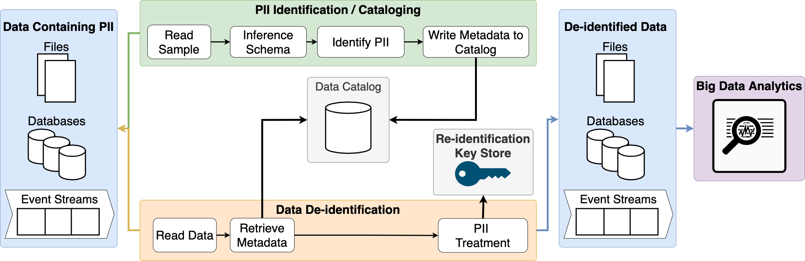
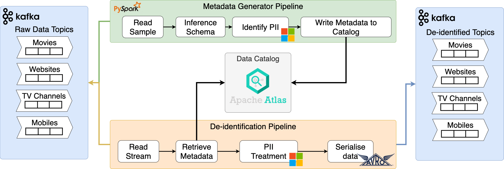
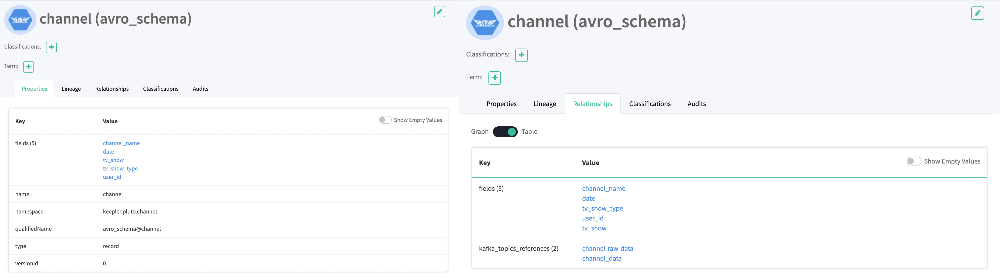
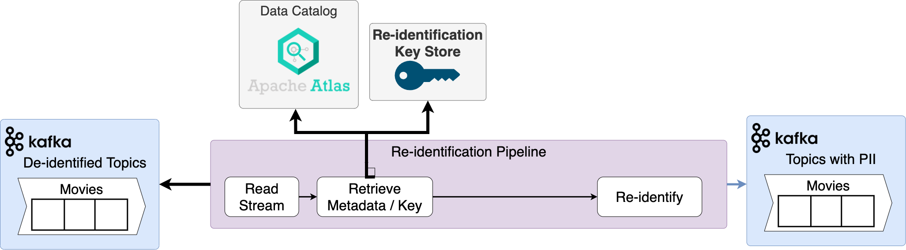

# De-Identification Framework

## Introduction

This technical demo is related to the following articles series published by [Keepler](https://keepler.io) called **Meet European Data Security and Privacy Compliance with Big Data Analytics in Public Cloud Environments**.

* [Part 1: Foundations](https://keepler.io/2021/09/european-data-security-and-privacy-compliance-part-1-foundations/)
* [Part 2: Case Studies in Business Environments](https://keepler.io/2021/10/meet-european-data-security-and-privacy-compliance-with-big-data-analytics-in-public-cloud-environments-part-2-case-studies-in-business-environments/)
* [Part 3: De-identification Framework via Open Source](#)TODO

It is advisable to read the articles beforehand to understand the problems to be solved and the proposed framework. 

## Solution Overview
In the third part of our series of articles we explain the solution we have devised to solve the problem of data security and privacy compliant with opensource technologies.
It is recommended to read it before continuing in order to understand the complete solution.

Once the solution is clear, a diagram is formed as follows:



For the purpose of this demo there are certain things that we have simplified, such as the variety of data sources, in this case we have stayed only with Events Streams.
However the proposed solution can be modified to accept all types of data sources.

If we place technology names in each of our components we are left with a diagram as follows.



### Data Ingestion

#### Apache Kafka

As mentioned above, in this technical demonstration we will only cover streaming input data.

For this we have chosen to use [Apache Kafka](https://kafka.apache.org/) due to its high throughput, capable of delivering messages with low latency.

It allows us to scale the clusters to ingest trillions of messages per day, petabytes of data, while being fault tolerant.
In addition, it allows us to perform joins, aggregations, filters, and transformations in event-time processing.

Finally we have a large number of diverse libraries in all the predominant programming languages.

#### Apache ZooKeepler

[Apache Kafka](https://kafka.apache.org/) uses [Apache Zookeeper](https://zookeeper.apache.org/) to do leadership election of Kafka Broker and Topic Partition pairs. 

It is also necessary for manage service discovery for Kafka Brokers that form the cluster. [Apache Zookeeper](https://zookeeper.apache.org/) sends changes of the topology to Kafka, so each node in the cluster knows when a new broker joined, a Broker died, a topic was removed or a topic was added, etc.

#### Confluent Schema Registry

We use the [Schema Registry](https://docs.confluent.io/platform/current/schema-registry/) to make sure that all the messages we have in our Kafka topics comply with the required schema.

[Schema Registry](https://docs.confluent.io/platform/current/schema-registry/) lives outside of and separately from your Kafka Brokers. Your producers and consumers still talk to [Apache Kafka](https://kafka.apache.org/) to publish and read data (messages) to topics. Concurrently, they can also talk to [Schema Registry](https://docs.confluent.io/platform/current/schema-registry/) to send and retrieve schemas that describe the data models for the messages.

However, this will not be our data catalog, but it is a very useful tool to use in conjunction with it.

### Schema Inference

For the schema inference process, we need a technology that allows us to interact with all kinds of data sources.
[Apache Spark](https://spark.apache.org/) is our choice since it unifies your data processing in batch and streaming in real time, using your preferred language: Python, SQL, Scala, Java or R.

It also allows us to perform exploratory data analysis on petabyte-scale data without resorting to downsampling.

To interact with Spark, we are going to make use of the  [PySpark](http://spark.apache.org/docs/latest/api/python/) library.

[PySpark](http://spark.apache.org/docs/latest/api/python/) is an interface for [Apache Spark](https://spark.apache.org/) in Python. It not only allows you to write Spark applications using Python APIs, but also provides the interacting shell for analyzing your data in a distributed environment. [PySpark](http://spark.apache.org/docs/latest/api/python/) supports most of Spark’s features such as Spark SQL, DataFrame, Streaming, MLlib (Machine Learning) and Spark Core.

### PII Identification

Identifying which part of your data is PII is the main task of this solution.
[Microsoft Presidio](https://microsoft.github.io/presidio/) offers a solution to preserve privacy in a simpler way, democratizing de-identification technologies and introducing transparency into decisions.

In addition, it allows us to extend its functionality by allowing us to create custom PII definitions in order to adapt it to our needs.

### Data Catalog

Looking at the [Apache Atlas](https://atlas.apache.org/#/) definition, this is exactly what we need.

> Apache Atlas provides open metadata management and governance capabilities for organizations to build a catalog of their data assets, classify and govern these assets and provide collaboration capabilities around these data assets for data scientists, analysts and the data governance team.

We will use [Apache Atlas](https://atlas.apache.org/#/) to store the inferred schemas, as well as the relationships with the PII types we find in their fields.

### De-Identification Pipeline
The last part of our solution is the data de-identification process.

In order not to complicate the solution, these pipelines are normal python processes, but in an enterprise solution they should be executed in a distributed processing framework such as [Apache Flink](https://flink.apache.org/).

However, in our solution, this process is a custom Python script.

#### Apache Avro

During the De-Identification pipeline, we are serializing the data in [Apache Avro](https://avro.apache.org/) format. 

[Apache Avro](https://avro.apache.org/) facilitates the exchange of big data between programs written in any language. With the serialization service, programs can efficiently serialize data into files or into messages.

[Apache Avro](https://avro.apache.org/) stores the data definition in JSON format making it easy to read and interpret; the data itself is stored in binary format making it compact and efficient.

## Quickstart

Now that we know the problems, the proposed solution and the chosen technologies, let's start with the demonstration of the solution.

We use Docker Compose to easily run the solution in an isolated environment built with Docker containers. Before starting, make sure you have install [docker](https://docs.docker.com/get-docker/) and [docker-compose](https://docs.docker.com/compose/install/)

### Build and run containers
In the root of the project run the following command, which will download the images from the remote repositories and build the custom images we have created.
```
docker-compose up --build
```
Make sure you have enough memory allocated to docker to prevent troubleshooting problems.

You can check that the containers are correctly lifted by running the following command
```
docker ps
```

```
CONTAINER ID   IMAGE                                   COMMAND                  CREATED       STATUS
3cf8b81a807d   demo_datapipeline_worker                "python3"                2 hours ago   Up 3 seconds
da58ad65d220   demo_producer                           "python3"                3 hours ago   Up 5 seconds
f0833097caa5   demo_spark-slave                        "/opt/bitnami/script…"   5 hours ago   Up 8 seconds 
8433542d91aa   demo_spark-master                       "/opt/bitnami/script…"   5 hours ago   Up 10 seconds
2b6cb71102c6   sansarip/apache-atlas                   "/opt/atlas_start.sh"    6 hours ago   Up 10 seconds
14d967dc967b   confluentinc/cp-schema-registry:5.3.6   "/etc/confluent/dock…"   2 weeks ago   Up 5 seconds
e60717eeb2a3   confluentinc/cp-kafka:5.4.0             "/etc/confluent/dock…"   2 weeks ago   Up 8 seconds
5625f65b8296   wurstmeister/zookeeper:3.4.6            "/bin/sh -c '/usr/sb…"   2 weeks ago   Up 10 seconds
```

### Setup Apache Kafka
For the purpose of the demo we need to have several [Apache Kafka](https://kafka.apache.org/) topics created.
To do this, run the file `create-kafka-topics.sh`
```
./create-kafka-topics.sh
```

You can check that the topics are created correctly by executing the following command:
```
docker-compose exec kafka kafka-topics --list --zookeeper zookeeper:2181
```
It will show you the following output:

```
__confluent.support.metrics
_schemas
channel-anonymised-data
channel-raw-data
mobile-anonymised-data
mobile-raw-data
movie-anonymised-data
movie-raw-data
website-anonymised-data
website-raw-data
```

### Generate sample messages

Inside the `src/dummy_data` folder you can find different types of messages to publish in [Apache Kafka](https://kafka.apache.org/). **We recommend to post all** of them to see all the **different behaviors of the solution**.

To send the messages you only have to execute the different scripts that are in the folder `src/data_generators`.
However, they have to be executed inside the ecosystem, in this case from the **producer container**.

To do so, run the following commands:
```

# Generate channel data
docker-compose exec producer python /opt/app/data_generators/producer_kafka_channel.py

# Generate movie data
docker-compose exec producer python /opt/app/data_generators/producer_kafka_movie.py

# Generate website data
docker-compose exec producer python /opt/app/data_generators/producer_kafka_website.py

# Generate mobile data
docker-compose exec producer python /opt/app/data_generators/producer_kafka_mobile.py
```

You can check the messages posted within the topics with the command
```
docker-compose exec kafka kafka-console-consumer --bootstrap-server kafka:9092 --topic <TOPIC> --from-beginning
```

For example the messages in the topic **channel-raw-data**.
```
{"channel_name": "Fox", "tv_show": "9-1-1", "tv_show_type": "Drama", "date": "12-10-2020", "user_id": "user-12345"}
{"channel_name": "Fox", "tv_show": "9-1-1", "tv_show_type": "Drama", "date": "12-10-2020", "user_id": "user-23456"}
{"channel_name": "Fox", "tv_show": "9-1-1", "tv_show_type": "Drama", "date": "12-10-2020", "user_id": "user-45678"}
{"channel_name": "Fox", "tv_show": "9-1-1", "tv_show_type": "Drama", "date": "07-09-2020", "user_id": "user-12345"}
{"channel_name": "Fox", "tv_show": "9-1-1", "tv_show_type": "Drama", "date": "23-08-2020", "user_id": "user-87654"}
{"channel_name": "Fox", "tv_show": "9-1-1", "tv_show_type": "Drama", "date": "23-08-2020", "user_id": "user-12345"}
{"channel_name": "HBO", "tv_show": "Barry", "tv_show_type": "Comedy", "date": "20-04-2020", "user_id": "user-23456"}
{"channel_name": "HBO", "tv_show": "Barry", "tv_show_type": "Comedy", "date": "20-04-2020", "user_id": "user-45678"}
{"channel_name": "HBO", "tv_show": "Barry", "tv_show_type": "Comedy", "date": "13-05-2020", "user_id": "user-98765"}
{"channel_name": "CBS", "tv_show": "Blood & Treasure", "tv_show_type": "Action", "date": "22-02-2020", "user_id": "user-23456"}
{"channel_name": "CBS", "tv_show": "Blood & Treasure", "tv_show_type": "Action", "date": "18-02-2020", "user_id": "user-87654"}
{"channel_name": "CBS", "tv_show": "Blood & Treasure", "tv_show_type": "Action", "date": "15-05-2020", "user_id": "user-87654"}
{"channel_name": "CBS", "tv_show": "Blood & Treasure", "tv_show_type": "Action", "date": "15-05-2020", "user_id": "user-45678"}
{"channel_name": "MTV", "tv_show": "Siesta Key", "tv_show_type": "Reality", "date": "14-06-2020", "user_id": "user-98765"}
{"channel_name": "MTV", "tv_show": "Siesta Key", "tv_show_type": "Reality", "date": "20-08-2020", "user_id": "user-98765"}
{"channel_name": "Disney Channel", "tv_show": "Andi Mack", "tv_show_type": "Comedy", "date": "13-10-2020", "user_id": "user-12345"}
```

### Infer Schema
The next step is to infer the schema and detect the PII in the sample messages.

We have created custom PII to see how [Presidio](https://microsoft.github.io/presidio/) behaves, such as **CUSTOM_CREDIT_CARD** or **USER_ID**.
You can find its definition in the `src/custom_recognizers` folder.

For this we are going to use the spark jobs that you can find in the folder `src/schema_inference`.

As in the message generation, we have to execute the jobs inside the containers, in this case inside the [Spark](https://spark.apache.org/) container.

```
# Infer Scheme Channel
docker-compose exec spark-master spark-submit --packages org.apache.spark:spark-sql-kafka-0-10_2.12:3.1.2 /opt/app/schema_inference/schema_inference_channel.py

# Infer Scheme Movie
docker-compose exec spark-master spark-submit --packages org.apache.spark:spark-sql-kafka-0-10_2.12:3.1.2 /opt/app/schema_inference/schema_inference_movie.py

# Infer Scheme Website
docker-compose exec spark-master spark-submit --packages org.apache.spark:spark-sql-kafka-0-10_2.12:3.1.2 /opt/app/schema_inference/schema_inference_website.py

# Infer Scheme Mobile
docker-compose exec spark-master spark-submit --packages org.apache.spark:spark-sql-kafka-0-10_2.12:3.1.2 /opt/app/schema_inference/schema_inference_mobile.py
```
### Schema inference checking
Check in [Apache Atlas](https://atlas.apache.org/#/) that the schemas and their relationships have been generated correctly.

We can see all properties, such as fields and relationships with other entities, such as [Apache Kafka](https://kafka.apache.org/) topics.



We can navigate to one of its fields, such as **user_id**, we can see that it is identified as **type string** and as PII of type **USER_ID**, one of our **custom PII**.


Finally, if we go to the PII **USER_ID**, we can see that it is related to the PII classification type.


### Execute de-identification pipeline
Once we have the schemas correctly generated and we have made corrections if necessary on [Apache Atlas](https://atlas.apache.org/#/), we proceed to use this information to de-identify the data.

You can find these scripts in the `src/deidentification_pipeline` folder. To execute them we are going to use the **datapipeline_worker container**.

```
# De-Identification pipeline Channel
docker-compose exec datapipeline_worker python /opt/app/deidentification_pipeline/deidentification_channel.py

# De-Identification pipeline Movie
docker-compose exec datapipeline_worker python /opt/app/deidentification_pipeline/deidentification_movie.py

# De-Identification pipeline Website
docker-compose exec datapipeline_worker python /opt/app/deidentification_pipeline/deidentification_website.py

# De-Identification pipeline Mobile
docker-compose exec datapipeline_worker python /opt/app/deidentification_pipeline/deidentification_mobile.py
```

Finally you can check the messages in the output topics, for example in the **channel-anonymised-data**.

```
{'channel_name': 'Fox', 'tv_show': '9-1-1', 'tv_show_type': 'Drama', 'date': '12-10-2020', 'user_id': 'gAAAAABhcXepaKw5QRE7bLEItiKPf-R5bSvqCp502AVV10Il3K67brj_iBzuNLOTc-fD66lYwcRV-fRRetIbWTRU3maw47L2Bg=='}
{'channel_name': 'Fox', 'tv_show': '9-1-1', 'tv_show_type': 'Drama', 'date': '12-10-2020', 'user_id': 'gAAAAABhcXeqSWBmJcNz9ik8sVoT33v2PdL29KwaYsDmZTM2GvfZxMUgFabNde94Y1QRFe2L4t3BbjfgxnhIHXKOCOWatbJDcA=='}
{'channel_name': 'Fox', 'tv_show': '9-1-1', 'tv_show_type': 'Drama', 'date': '12-10-2020', 'user_id': 'gAAAAABhcXeq64BnOKOEDvsgqr34hI6tGw4xia37gx7-o9MDdkzzqJLUlBk3QOevqi5n8dvivRFhl0NjpGf73yrPvWy-MnzeRQ=='}
{'channel_name': 'Fox', 'tv_show': '9-1-1', 'tv_show_type': 'Drama', 'date': '07-09-2020', 'user_id': 'gAAAAABhcXeqEWO9XQjuWxFeNmQcRznxtSoEGTYZPBg4jicfHHucQhn5J96FIME6wP7UTdUYdSGI9LOn0-rHEMpH7oaVWUt4yg=='}
{'channel_name': 'Fox', 'tv_show': '9-1-1', 'tv_show_type': 'Drama', 'date': '23-08-2020', 'user_id': 'gAAAAABhcXeqAJYSpnfuQBKg5iqXWMChm7hZXIt6byEv20rsn839akRqNvpEPS_7YYf3PSq_Ixao24EW2MRf5_2MONbIjKfwOQ=='}
{'channel_name': 'Fox', 'tv_show': '9-1-1', 'tv_show_type': 'Drama', 'date': '23-08-2020', 'user_id': 'gAAAAABhcXeqJx5lY7lgU-aaRMBAPISXRfW66FHGH5EJzMCNKL6t-cg3ziREnbrGMLJ99q9mBYz28DWfT2gV5co9-j9qdLLP6g=='}
{'channel_name': 'HBO', 'tv_show': '<PERSON>', 'tv_show_type': 'Comedy', 'date': '20-04-2020', 'user_id': 'gAAAAABhcXeqHv9304N0SDm8K-UbGJkJD9udfnOQTusF4kO9xsXHHFUMK70i-msOQwyATHv2ro2Cf8VCxutT0cNBREkazZuZig=='}
{'channel_name': 'HBO', 'tv_show': '<PERSON>', 'tv_show_type': 'Comedy', 'date': '20-04-2020', 'user_id': 'gAAAAABhcXeqXauz460yFKlnYr1syUCduDKq81Kq_88hz5ZRjJI78bPkDQZr0oKyTsJ94f8FTONYpHrlgA83hW0aSrDLtAkZpg=='}
{'channel_name': 'HBO', 'tv_show': '<PERSON>', 'tv_show_type': 'Comedy', 'date': '13-05-2020', 'user_id': 'gAAAAABhcXequXKX3DK_REUUseeaXr39Z8q2xKxW92N1BHzfXWdmU1gce0chn6XtT6iqCfQygpp1zXiIB7JguLEFE7Dt782oww=='}
{'channel_name': 'CBS', 'tv_show': 'Blood & Treasure', 'tv_show_type': 'Action', 'date': '22-02-2020', 'user_id': 'gAAAAABhcXeq0QckN6Jdo2cid6L0ov48smP9Km5zReR2j69YJ_2I0m7XcfRlKcnvAO0uUM34ER6BcpEAF5Yr9_MM78xpDadXTA=='}
{'channel_name': 'CBS', 'tv_show': 'Blood & Treasure', 'tv_show_type': 'Action', 'date': '18-02-2020', 'user_id': 'gAAAAABhcXequ6nY-fkBsSEpvjBSTofOXVy7HGhR99v-zu7UNEvGWwbtquVHLCMafFPmTL6Vr1e0sTeu1Kw4OINdXyQG9ajazg=='}
{'channel_name': 'CBS', 'tv_show': 'Blood & Treasure', 'tv_show_type': 'Action', 'date': '15-05-2020', 'user_id': 'gAAAAABhcXeq26TYu9_-Z7shjmL05IpUw30JhzdJSLwsK9r16mEqXGkkU90x-lwoNgLY0UhbWAmPLWXWU_JcNCPj3p6r37-bqA=='}
{'channel_name': 'CBS', 'tv_show': 'Blood & Treasure', 'tv_show_type': 'Action', 'date': '15-05-2020', 'user_id': 'gAAAAABhcXeq-sJXYVcECNkN0DsfYAocsT04RcqtFKHlRVKtQLaKKa5gU1DDTcducYhYhqF5j4mWV6-8XI6iLpvAZf5U5RomZQ=='}
{'channel_name': 'MTV', 'tv_show': 'Siesta Key', 'tv_show_type': 'Reality', 'date': '14-06-2020', 'user_id': 'gAAAAABhcXeqpGKqBg63WA9K6k3L3fiZH-YJKB01jNWC7Fn8hvSX7jc6Q0VkpU7I8xgfwr6-mIZCSEtDsA5nOuECp1ZZpYgvHw=='}
{'channel_name': 'MTV', 'tv_show': 'Siesta Key', 'tv_show_type': 'Reality', 'date': '20-08-2020', 'user_id': 'gAAAAABhcXeq_YNS_JgbiHD5Un8IopLwGADkhQ6ZWrZ6QSE6ZncohrDvpIdiPRGSYA9quDz-p6IehxMg4BC-RRzPKY4pxSrtvg=='}
{'channel_name': 'Disney Channel', 'tv_show': '<PERSON>', 'tv_show_type': 'Comedy', 'date': '13-10-2020', 'user_id': 'gAAAAABhcXeqEuYw2LKNcczosz93fiJY4yN5CiVFwtT53FIAMDchFscFcVLmxcpkzt3rCmART-oGzvqDluHsAgNGh8W73pfvUQ=='}
```

You may notice that in some cases, [Presidio](https://microsoft.github.io/presidio/) identified some tv show names as **PII** of type **PERSON**, 
such as.

```
{'channel_name': 'HBO', 'tv_show': 'Barry', 'tv_show_type': 'Comedy', 'date': '20-04-2020', 'user_id': 'user-45678'}
```
```
{ 'channel_name': 'HBO', 'tv_show': '<PERSON>', 'tv_show_type': 'Comedy', 'date': '20-04-2020', 'user_id': 'gAAAAAAABhcXeqXauz460yFKlnYr1syUCduDKq81Kqq_88hz5ZRjJI78bPkDQZr0oKyTsJ94f8FTONYpHrlgA83hW0aSrDLtAkZpg=='}
```

This is why it is **IMPORTANT TO REVIEW** the schema inferred in [Apache Atlas](https://atlas.apache.org/#/) before executing the de-identification process, since this field should **never** be taken as **PII of type PERSON**.

### Execute the re-identification-pipeline

The last functionality that remains to be demonstrated is the reverse process, or how to return the data to its original state.
This is what is called the re-identification of the data.



You can find these scripts in the src/reidentification_pipeline folder. To execute them we are going to use the datapipeline_worker container.

For this process, we have not used Presidio, since the re-identification part or as he calls deanonymization is very unversatile, but nevertheless we have followed a similar approach.

```
# Re-Identification Channel
docker-compose exec datapipeline_worker python /opt/app/reidentification_pipeline/reidentification_channel.py

# Re-Identification Movie
docker-compose exec datapipeline_worker python /opt/app/reidentification_pipeline/reidentification_movie.py

# Re-Identification Website
docker-compose exec datapipeline_worker python /opt/app/reidentification_pipeline/reidentification_website.py

# Re-Identification Mobile
docker-compose exec datapipeline_worker python /opt/app/reidentification_pipeline/reidentification_mobile.py
```

Finally you can check the the output messages, for example in the **channel data**.

```
{'channel_name': 'Fox', 'date': '12-10-2020', 'tv_show': '9-1-1', 'tv_show_type': 'Drama', 'user_id': 'user-12345'}
{'channel_name': 'Fox', 'date': '12-10-2020', 'tv_show': '9-1-1', 'tv_show_type': 'Drama', 'user_id': 'user-23456'}
{'channel_name': 'Fox', 'date': '12-10-2020', 'tv_show': '9-1-1', 'tv_show_type': 'Drama', 'user_id': 'user-45678'}
{'channel_name': 'Fox', 'date': '07-09-2020', 'tv_show': '9-1-1', 'tv_show_type': 'Drama', 'user_id': 'user-12345'}
{'channel_name': 'Fox', 'date': '23-08-2020', 'tv_show': '9-1-1', 'tv_show_type': 'Drama', 'user_id': 'user-87654'}
{'channel_name': 'Fox', 'date': '23-08-2020', 'tv_show': '9-1-1', 'tv_show_type': 'Drama', 'user_id': 'user-12345'}
{'channel_name': 'HBO', 'date': '20-04-2020', 'tv_show': '<PERSON>', 'tv_show_type': 'Comedy', 'user_id': 'user-23456'}
{'channel_name': 'HBO', 'date': '20-04-2020', 'tv_show': '<PERSON>', 'tv_show_type': 'Comedy', 'user_id': 'user-45678'}
{'channel_name': 'HBO', 'date': '13-05-2020', 'tv_show': '<PERSON>', 'tv_show_type': 'Comedy', 'user_id': 'user-98765'}
{'channel_name': 'CBS', 'date': '22-02-2020', 'tv_show': 'Blood & Treasure', 'tv_show_type': 'Action', 'user_id': 'user-23456'}
{'channel_name': 'CBS', 'date': '18-02-2020', 'tv_show': 'Blood & Treasure', 'tv_show_type': 'Action', 'user_id': 'user-87654'}
{'channel_name': 'CBS', 'date': '15-05-2020', 'tv_show': 'Blood & Treasure', 'tv_show_type': 'Action', 'user_id': 'user-87654'}
{'channel_name': 'CBS', 'date': '15-05-2020', 'tv_show': 'Blood & Treasure', 'tv_show_type': 'Action', 'user_id': 'user-45678'}
{'channel_name': 'MTV', 'date': '14-06-2020', 'tv_show': 'Siesta Key', 'tv_show_type': 'Reality', 'user_id': 'user-98765'}
{'channel_name': 'MTV', 'date': '20-08-2020', 'tv_show': 'Siesta Key', 'tv_show_type': 'Reality', 'user_id': 'user-98765'}
{'channel_name': 'Disney Channel', 'date': '13-10-2020', 'tv_show': '<PERSON>', 'tv_show_type': 'Comedy', 'user_id': 'user-12345'}
{'channel_name': 'Fox', 'date': '12-10-2020', 'tv_show': '9-1-1', 'tv_show_type': 'Drama', 'user_id': 'user-12345'}
{'channel_name': 'Fox', 'date': '12-10-2020', 'tv_show': '9-1-1', 'tv_show_type': 'Drama', 'user_id': 'user-23456'}
{'channel_name': 'Fox', 'date': '12-10-2020', 'tv_show': '9-1-1', 'tv_show_type': 'Drama', 'user_id': 'user-45678'}
{'channel_name': 'Fox', 'date': '07-09-2020', 'tv_show': '9-1-1', 'tv_show_type': 'Drama', 'user_id': 'user-12345'}
{'channel_name': 'Fox', 'date': '23-08-2020', 'tv_show': '9-1-1', 'tv_show_type': 'Drama', 'user_id': 'user-87654'}
{'channel_name': 'Fox', 'date': '23-08-2020', 'tv_show': '9-1-1', 'tv_show_type': 'Drama', 'user_id': 'user-12345'}
{'channel_name': 'HBO', 'date': '20-04-2020', 'tv_show': '<PERSON>', 'tv_show_type': 'Comedy', 'user_id': 'user-23456'}
{'channel_name': 'HBO', 'date': '20-04-2020', 'tv_show': '<PERSON>', 'tv_show_type': 'Comedy', 'user_id': 'user-45678'}
{'channel_name': 'HBO', 'date': '13-05-2020', 'tv_show': '<PERSON>', 'tv_show_type': 'Comedy', 'user_id': 'user-98765'}
{'channel_name': 'CBS', 'date': '22-02-2020', 'tv_show': 'Blood & Treasure', 'tv_show_type': 'Action', 'user_id': 'user-23456'}
{'channel_name': 'CBS', 'date': '18-02-2020', 'tv_show': 'Blood & Treasure', 'tv_show_type': 'Action', 'user_id': 'user-87654'}
{'channel_name': 'CBS', 'date': '15-05-2020', 'tv_show': 'Blood & Treasure', 'tv_show_type': 'Action', 'user_id': 'user-87654'}
{'channel_name': 'CBS', 'date': '15-05-2020', 'tv_show': 'Blood & Treasure', 'tv_show_type': 'Action', 'user_id': 'user-45678'}
{'channel_name': 'MTV', 'date': '14-06-2020', 'tv_show': 'Siesta Key', 'tv_show_type': 'Reality', 'user_id': 'user-98765'}
{'channel_name': 'MTV', 'date': '20-08-2020', 'tv_show': 'Siesta Key', 'tv_show_type': 'Reality', 'user_id': 'user-98765'}
{'channel_name': 'Disney Channel', 'date': '13-10-2020', 'tv_show': '<PERSON>', 'tv_show_type': 'Comedy', 'user_id': 'user-12345'}
```

It is worth mentioning that during the de-identification process different methods were chosen depending on the type of PII, for example for **CREDIT_CARD** we used the method of hashing the value with sha256, which is only reversible by brute force.

Another possible solution is to have a key-value database in which to store the relationship of a hash to its original value.

This is why it is **important** to **choose well the de-identification method** you want to use to make sure that if you need to recover the original data at some point you will not encounter such a problem.

## Authors
[Diego Prieto](https://www.linkedin.com/in/dpt92/)

[Alexander Deriglasow](https://www.linkedin.com/in/alexander-deriglasow/)